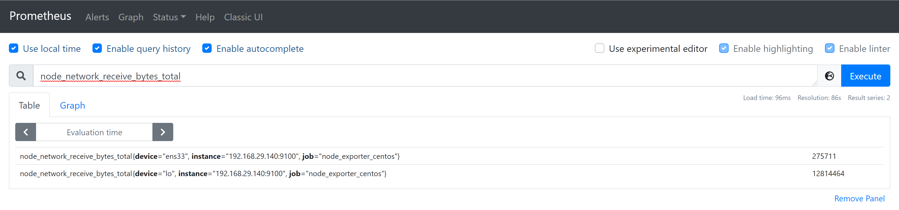

# Monitor và lấy một vài thông số cơ bản 

**Giám sát máy ảo có địa chỉ IP: 192.168.29.140**

### Network: 
- Thông số lấy từ VM 

###### Input

###### Output

### Disk 
- node_filesystem_size{mountpoint="/"}
###### Used
- node_filesystem_size{mountpoint="/"} - node_filesystem_free{mountpoint="/"}
###### Available
- node_filesystem_free{mountpoint="/"}

### RAM
- node_memory_MemTotal
###### Free
- node_memory_MemFree
###### Used
- node_memory_MemTotal - node_memory_MemFree
### CPU
- 